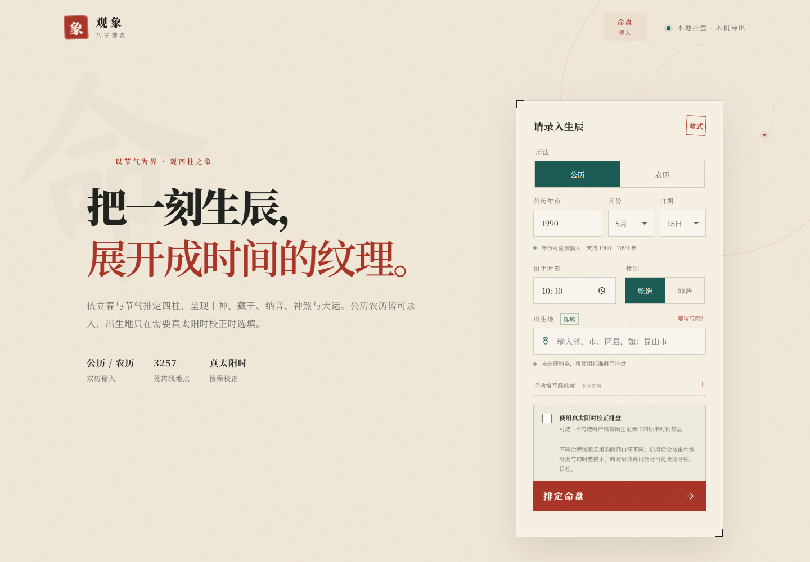
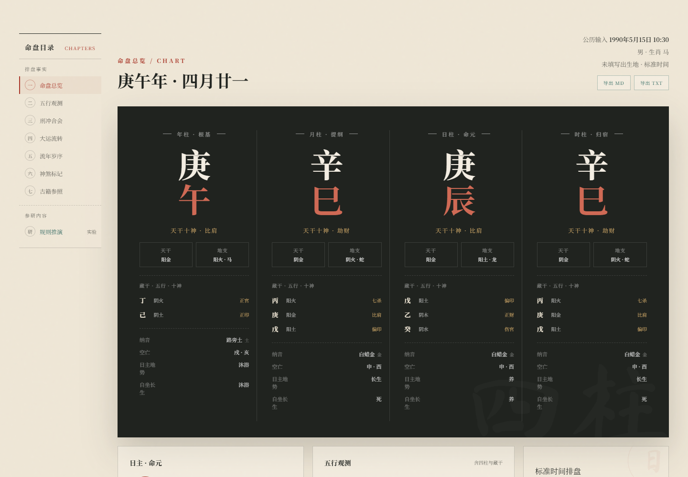

# 观象 · 八字排盘

观象是一个本地优先的四柱排盘与传统命理知识展示网页。历法计算基于 `lunar-python`，服务端使用 Python 标准库，前端为原生 HTML/CSS/JavaScript，无需构建步骤。





## 启动

```bash
pip install -r requirements.txt
python web_server.py
```

访问 <http://127.0.0.1:8787>。

## 功能

- 公历、农历双历输入，农历含月份天数与闰月校验
- 离线地点库支持省、市、区县搜索；出生地选填，仅记录不改变命盘
- 真太阳时校正默认关闭，勾选并提供经度后才启用；当前仅按中国标准时间（UTC+8）处理
- 四柱、十神、藏干、纳音、空亡、神煞、十二长生与刑冲合会
- 全部有效大运与未来五年流年
- 一键导出 Markdown / TXT，导出全程在本机完成

## 排盘方法

- 历法由 `lunar-python` 与本地基础表推算：立春定年柱，节气定月柱，日柱连续纪日，时柱由日干与时支推定；晚子时按已验证的上游行为换至次日日柱
- 真太阳时校正（可选）：按出生地经度差与均时差修正，默认关闭，仅支持中国标准时间（UTC+8）口径
- 大运按出生时刻与节气的间隔折算起运，依年干阴阳与性别顺排或逆排，输出全部有效大运；流年取未来五年
- 十神以日干为我，另输出藏干、纳音、空亡、十二长生与刑冲合会

## 参考古籍

- 《穷通宝鉴》（徐乐吾评注版）：十干十二月月令断语 120 条与调候用神表
- 《滴天髓》：十干性格断语
- 《三命通会》卷二：大运、流年断语（论大运 / 论小运 / 论太岁）
- 《子平真诠》（沈孝瞻原文，徐乐吾评注）：旺衰格局取用的用神五法——扶抑、病药、调候、专旺、通关
- 知识库条文中另引用《渊海子平》《星平会海》《相心赋》等

古籍内容为条文参照与简化匹配，只在标注位置展示，不构成完整个人论命结论。

## 内容口径

- 数据分四层标识：`历法计算`、`逆向确认`、`古籍参照`、`实验模型`；旺衰、格局、取用等推演默认折叠并单独标注。
- 五行数量只作结构计数，不等同于旺衰或喜用神；古籍内容为条文参照与简化匹配，不代表唯一命理结论。
- 晚子时按已验证的上游行为换至次日日柱；没有确定匹配规则的知识短语不会进入个人命盘。
- 本项目用于传统文化研究与娱乐体验，不构成医疗、法律、投资或人生决策建议。

## 验证

```bash
# validate_oracle.py 需要 requirements-dev.txt 中的 sxtwl 作独立校验源
pip install -r requirements-dev.txt
python -W error::ResourceWarning -m unittest discover -s tests -v
python scripts/validate_oracle.py
python scripts/validate_knowledge.py
python -m compileall -q bazi scripts web_server.py main.py
node --check web/app.js

# 可选：浏览器布局回归（需 Python Playwright 与本机 Chrome/Chromium）
python scripts/check_ui_layout.py
```

## 目录

```text
bazi/       排盘引擎、规则与 Web Schema
knowledge/  运行时知识数据
scripts/    地点构建、知识校验与浏览器回归工具
tests/      引擎、Web 请求和前端契约测试
web/        网页资源；正式入口为 web_server.py
```

版本历史见 `CHANGELOG.md`，界面设计约定见 `DESIGN.md`。
